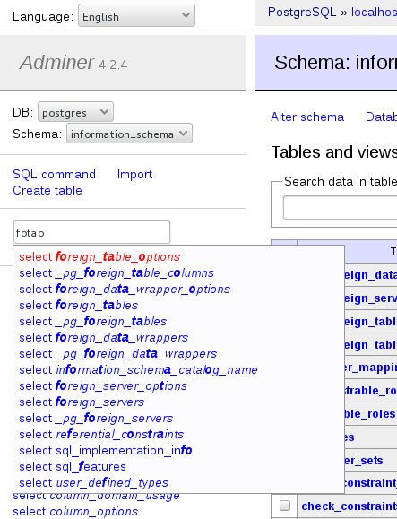

# Presentation


AdminerTablesFuzzySearch is a **plugin for [Adminer](http://www.adminer.org/)** that add a **fuzzy search** function on current DB tables. This is really usefull when working on hudge databases with tons of tables.



## Usage

  * use **'F'** [access key](https://en.wikipedia.org/wiki/Access_key) to give focus to fuzzy search input. Depending on browser, it could be **alt-shift-F** or other key combination
  * type fuzzy name of table (without spaces)
  * use keyboard keys to select correct match
  * press **enter** to open selected table (or **shift-enter** to open it into a new tab)

# Installation

1. [Download](http://www.adminer.org/#download) and install Adminer tool

2. Create plugins folder next to adminer.php

3. [Download `plugins.php`](https://raw.githubusercontent.com/vrana/adminer/master/plugins/plugin.php), this file is needed to load plugins; and place it into plugins folder

4. [Download `adminer-tables_fuzzy_search.php`](https://github.com/brunetton/adminer-tables_fuzzy_search/blob/master/adminer-tables_fuzzy_search.php) and place it into plugins folder

File structure will be:
```
- adminer.php
- plugins
    - plugin.php
	- adminer-tables_fuzzy_search.php
	- ... (other plugins you've already installed)
```

5. Edit or create `index.php` file next to adminer.php and [configure plugins](http://www.adminer.org/plugins/#use) and add `new AdminerTablesFuzzySearch()` to $plugins array :

```php
<?php

	function adminer_object()
	{
		// required to run any plugin
		include_once "./plugins/plugin.php";

		// autoloader
		foreach (glob("plugins/*.php") as $filename) {
			include_once "./$filename";
		}

		$plugins = array(
			// specify enabled plugins here
			new AdminerTablesFuzzySearch(),
		);

		return new AdminerPlugin($plugins);
	}

	// include original Adminer or Adminer Editor
	include "./adminer.php";
```

Final file structure will be:
```
- adminer.php
- index.php
- plugins
	- plugin.php
	- adminer-tables_fuzzy_search.php
	- ...
```

# Credits

All fuzzy search is done with the excellent [Ben Ripkens](https://github.com/bripkens)'s [fuzzy.js](https://github.com/bripkens/fuzzy.js) library.
